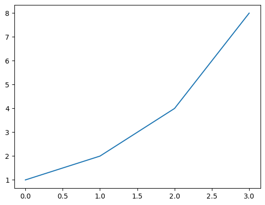

\# Jupyter Notebook使用方法

- order: 14

<!-- WARNING: THIS FILE WAS AUTOGENERATED! DO NOT EDIT! -->

Jupyter
Notebook是一个开源的Web应用程序，既提供了交互式的编程环境，又是可以作为记录相关信息的笔记本，这样的属性使它非常适合Python新手学习和编程。

我们看一下下面这个例子，可以通过Python运行得到计算结果：

``` python
1+2
```

    3

通过代码，文字结合的形式，并通过实时反馈运行结果，Jupyter
Notebook成为实验性编程的完美环境。

现在你可以自己尝试一下. 点击右上角的”Copy &
Edit”可以得到你自己的可编辑版本, 选择当前单元并且输入 `Shift`-`Enter`.

很多机构都在使用Jupyter Notebook, 包括Google, Microsoft, IBM, Bloomberg,
Berkeley and NASA 等等. 甚至诺贝尔经济学得主 [都在使用Jupyter
Notebooks](https://paulromer.net/jupyter-mathematica-and-the-future-of-the-research-paper/)
并且有报道认为Jupyter
Notebooks将作为[新形式的研究论文](https://www.theatlantic.com/science/archive/2018/04/the-scientific-paper-is-obsolete/556676/).

- 交互式编程环境，可以实时运行和展示代码、公式、可视化和叙述性文本
- 支持代码分块执行，便于调试和学习
- 将代码、输出、图表和解释集中在一个文档中

## 文字写作

一种输入文字的单元叫做 *Markdown cell*.
[*Markdown*](https://en.wikipedia.org/wiki/Markdown)
是一种流行的标记语言。要指定一个单元为Markdown，你需要单击工具栏中的下拉菜单并选择Markdown。

请点击下方的“+
Markdown”按钮。现在你可以输入你的第一个Markdown单元。写下“我的第一个markdown单元”并点击运行。

你应该会看到类似以下内容：

我的第一个markdown单元

现在尝试创建你的第一个 *代码* 单元：按照之前的步骤，但点击 +
Code。输入类似 3/2 的内容。你应该看到输出为 ‘1.5’

``` python
3/32
```

    0.09375

## 模式

如果你在 *Markdown*
单元格中犯了一个错误并且你已经运行了它，你会注意到你无法仅通过单击它来编辑它。这是因为你处于**命令模式**。
Jupyter Notebooks 有两种不同的模式： -
编辑模式：：允许你编辑单元格的内容。 -
命令模式：：允许你将笔记本作为一个整体进行编辑并使用键盘快捷键，但不能编辑单元格的内容。
你可以通过按 <kbd>ESC</kbd> 和 <kbd>Enter</kbd>
或单击单元格外部或内部（如果是 Markdown
单元格，则需要双击）来在这两者之间切换。你始终可以知道自己处于哪种模式：当前单元格在**编辑模式**中将具有绿色边框，在**命令模式**中将具有蓝色边框。试试吧！

## 其他重要考虑因素

你的笔记本每 120
秒自动保存一次。如果你想手动保存，只需按右上角的“保存版本”按钮即可。
要了解你的*内核*（在幕后执行指令的 Python
引擎）是否正在计算，您可以检查单元格左侧的图标。如果圆点旋转，则表示内核正在工作。如果没有，则处于闲置状态。
你必须了解我们**所有**使用的几个快捷方式（始终处于**命令模式**）。这些都是： -
<kbd>Shift</kbd>+<kbd>Enter</kbd>：在单元格上运行代码或 Markdown -
<kbd>向上箭头</kbd> / <kbd>向下箭头</kbd>：在单元格之间切换 -
<kbd>b</kbd>：在该单元格下创建新单元格 -
<kbd>0</kbd>+<kbd>0</kbd>：重置内核 你可以通过键入 <kbd>h</kbd>
（寻求帮助）来找到更多快捷方式。 你可能需要使用 shell 命令，例如 Jupyter
Notebook 环境中的“ls”或“cat”。这很容易做到：只需在 shell 命令之前输入
`!`，如下所示：

``` python
!pwd
```

    /Users/hacker/Code/Github/python101/nbs

## Markdown 格式

### 图片

<figure>

<figcaption aria-hidden="true">image.png</figcaption>
</figure>

你知道Jupyter Notebook团队获得了软件系统的最高荣誉——ACM软件系统奖吗？

<figure>

<figcaption aria-hidden="true">image.png</figcaption>
</figure>

你知道吗，你可以像我在上面的单元格中那样向你的笔记本添加图片吗？要做到这一点，只需将你的图片复制到计算机上，然后粘贴到一个
markdown 单元格中。你会看到像这样的内容：

<figure>

<figcaption aria-hidden="true">image.png</figcaption>
</figure>

当你执行该单元格时，你会看到图片出现

### 斜体、粗体、删除线、行内、引用和链接

使用Markdown时格式化代码的五个最重要概念是：

- *斜体*:: 用_或\*包围你的文本。
- **粗体**:: 用\_\_或\*\*包围你的文本。
- `引用`:: 用\`包围你的文本。
- 引用:: 在你的文本前放置\>。
- [链接](http://course-v3.fast.ai/)::
  用\[\]包围你想链接的文本，并将链接放在文本旁边，用()包围

### 标题

注意，在 markdown
单元格中在文本前添加一个井号会使文本成为标题。包含的井号数量将决定标题的优先级（#
是一级，## 是二级，### 是三级，#### 是四级）。我们将通过左侧的 +
按钮添加三个新单元格，以查看每个级别的标题效果。
在笔记本中，双击一些标题，找出它们是什么级别！

### 列表

在markdown中有三种类型的列表。 有序列表： 1. 步骤1 2. 步骤1B 3. 步骤3
无序列表 \* 学习率 \* 周期长度 \* 权重衰减 任务列表 - \[x\]
学习Jupyter笔记本 - \[x\] 写作 - \[x\] 模式 - \[x\] 其他考虑 - \[ \]
改变世界 在笔记本中，双击它们以查看它们是如何构建的！

## 代码能力

**代码**单元与**Markdown**单元不同，因为它们有一个输出单元。这意味着我们可以在笔记本中_保留_代码的结果并分享它们。假设我们想展示一个解释实验结果的图表。我们只需运行必要的单元并保存笔记本。再次打开时，输出将会在那里！通过运行接下来的两个单元试试看吧。

``` python
a = 1
b = a + 1
c = b + a + 1
d = c + b + a + 1
a, b, c ,d
```

    (1, 2, 4, 8)

``` python
import matplotlib.pyplot as plt

plt.plot([a,b,c,d])
plt.show()
```



## 本地运行Jupyter

这个笔记本正在Kaggle中运行。您还可以在其他云环境中运行笔记本，例如[Colab](https://colab.research.google.com)、[Sagemaker
Studio Lab](https://studiolab.sagemaker.aws/)和[Paperspace
Gradient](https://gradient.run/notebooks)。或者您可以从本地计算机运行Jupyter
Notebook服务器。更重要的是，如果您已安装Anaconda，您甚至不需要安装Jupyter（如果没有，只需`pip install jupyter`）。
您只需在终端中运行`jupyter notebook`。请记住从包含您想要访问的所有文件夹/文件的文件夹中运行它。您将能够打开、查看和编辑您运行此命令的目录中的文件，但无法访问父目录中的文件。
如果在您运行命令后浏览器标签页没有自动打开，您应该CTRL+CLICK以’http://localhost:’
开头的链接，这将会在您的默认浏览器中打开一个新标签页。

## 快捷键和技巧

这里有一些在 Jupyter Notebook
中有用的技巧列表。确保你尽早学习它们，并尽可能多地使用它们！

### 命令模式快捷键

在`命令模式`中有几个有用的键盘快捷键，可以帮助你更快地使用Jupyter
Notebook。记住，你可以通过<kbd>Esc</kbd>和<kbd>Enter</kbd>在`命令模式`和`编辑模式`之间来回切换。 -
m:: 将单元格转换为Markdown - y:: 将单元格转换为代码 - d+d:: 删除单元格 -
o:: 切换隐藏或显示输出 - Shift+向上箭头/向下箭头::
选择多个单元格。一旦选择了它们，你可以像批处理一样对它们进行操作（运行、复制、粘贴等）。 -
Shift+M:: 合并选定的单元格

### 单元操作技巧

- Shift+M:: 合并选定的单元格 你还可以在单元格中编写一些技巧：
- `?function-name`:: 显示该函数的定义和文档字符串
- `??function-name`:: 显示该函数的源代码
- `doc(function-name)`:: 显示该函数的定义、文档字符串**和文档链接**
  （仅在导入fastai库时有效）
- Shift+Tab（按一次）:: 查看传递给函数的参数
- Shift+Tab（按三次）:: 获取有关该方法的更多信息
  这是一个使用`?`了解Python的`print()`函数的示例：

``` python
?print
```

``` python
??print
```

### 行魔法

行魔法是可以在单元格上运行的函数。它们应该位于行的开头，并将调用它们的行的其余部分作为参数。通过在命令前放置
‘%’ 符号来调用它们。最有用的包括： - `%matplotlib inline`:: 确保所有
matplotlib 图将在笔记本的输出单元格中绘制，并在保存时保留在笔记本中。

``` python
%matplotlib inline
```

- `%timeit`:: 运行一行一万次，并显示运行所需的平均时间。

``` python
```

    17 µs ± 97 ns per loop (mean ± std. dev. of 7 runs, 100,000 loops each)

%debug:
使用Python调试器检查显示错误的函数。如果您在错误后立即在单元格中输入此内容，您将被引导到一个控制台，在那里您可以检查所有变量的值。
