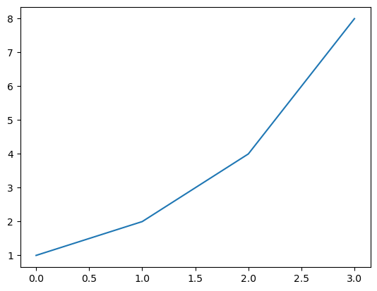

 # Jupyter Notebook使用方法
 
 - order: 14

::: {#dc5e0ffe-39de-4e7a-8c4b-829482995b14 .cell}
``` {.python .cell-code}
1+2
```
:::


::: {#8af2325c-c1ed-4beb-901b-09f71fe501b6 .cell}
``` {.python .cell-code}
3-53456
```
:::


Let's build up from the basics: what is a Jupyter Notebook? A notebook is a document made of cells. You can write in some of them (markdown cells) or you can perform calculations in Python (code cells) and run them like this:

::: {#45de1e93 .cell papermill='{"duration":0.061017,"end_time":"2022-04-24T20:37:13.134940","exception":false,"start_time":"2022-04-24T20:37:13.073923","status":"completed"}' tags='[]'}
``` {.python .cell-code}
1+1
```
:::


Cool, huh? This combination of prose and code makes Jupyter Notebook ideal for experimentation: we can see the rationale for each experiment, the code, and the results in one comprehensive document. 

Try it yourself now. Click "Copy & Edit" in the top right to get your own editable version of this notebook, then click the cell above and hit `Shift`-`Enter`.

Other renowned institutions in academia and industry use Jupyter Notebook, including Google, Microsoft, IBM, Bloomberg, Berkeley and NASA among others. Even Nobel-winning economists [use Jupyter Notebooks](https://paulromer.net/jupyter-mathematica-and-the-future-of-the-research-paper/)  for their experiments and some suggest that Jupyter Notebooks will be the [new format for research papers](https://www.theatlantic.com/science/archive/2018/04/the-scientific-paper-is-obsolete/556676/).

# Writing

A type of cell in which you can write text is called a _Markdown cell_. [_Markdown_](https://en.wikipedia.org/wiki/Markdown) is a very popular markup language. To specify that a cell is Markdown you need to click in the drop-down menu in the toolbar and select Markdown.

Click the '+ Markdown' button below. Now you can type your first Markdown cell. Write 'My first markdown cell' and press run.

You should see something like this:

My first markdown cell

Now try making your first _Code_ cell: follow the same steps as before but click "+ Code". Type something like 3/2. You should see '1.5' as output.

::: {#c1f11819 .cell papermill='{"duration":0.047182,"end_time":"2022-04-24T20:37:13.596991","exception":false,"start_time":"2022-04-24T20:37:13.549809","status":"completed"}' tags='[]'}
``` {.python .cell-code}
3/32
```
:::


## Modes

If you made a mistake in your *Markdown* cell and you have already run it, you will notice that you cannot edit it just by clicking on it. This is because you are in **Command Mode**. Jupyter Notebooks have two distinct modes:

- Edit Mode:: Allows you to edit a cell's content.

- Command Mode:: Allows you to edit the notebook as a whole and use keyboard shortcuts but not edit a cell's content. 

You can toggle between these two by either pressing <kbd>ESC</kbd> and <kbd>Enter</kbd> or clicking outside a cell or inside it (you need to double click if it's a Markdown cell). You can always tell which mode you're on: the current cell will have a green border in **Edit Mode** and a blue border in **Command Mode**. Try it!

## Other Important Considerations

Your notebook is autosaved every 120 seconds. If you want to manually save it you can just press the "save version" button on the upper right corner.

To know if your *kernel* (the Python engine executing your instructions behind the scenes) is computing or not, you can check the icon to the left of your cell. If the dot spinning, it means that the kernel is working. If not, it is idle.

There are a couple of shortcuts you must know about which we use **all** the time (always in **Command Mode**). These are:

- <kbd>Shift</kbd>+<kbd>Enter</kbd>: Run the code or markdown on a cell
- <kbd>Up Arrow</kbd> / <kbd>Down Arrow</kbd>: Toggle across cells
- <kbd>b</kbd>: Create new cell underneath this one
- <kbd>0</kbd>+<kbd>0</kbd>: Reset Kernel

You can find more shortcuts by typing <kbd>h</kbd> (for help).

You may need to use shell commands, like `ls` or `cat` in a Jupyter Notebook environment. That is very easy to do: just type `!` before you shell command, like so:

::: {#65c1b756 .cell papermill='{"duration":0.79428,"end_time":"2022-04-24T20:37:14.729911","exception":false,"start_time":"2022-04-24T20:37:13.935631","status":"completed"}' tags='[]'}
``` {.python .cell-code}
!pwd
```
:::


That's it. This is all you need to know to use Jupyter Notebooks. That said, we have more tips and tricks below... There's a lot you can do with notebooks -- in fact, we published [a whole book](https://www.amazon.com/Deep-Learning-Coders-fastai-PyTorch/dp/1492045527) written entirely as notebooks!

## Markdown Formatting

### Images

 old")

Did you know that the Jupyter Notebook team won the highest honor for a software system, the ACM Software System Award?


And did you know that you can add images to your notebook, like I did in the cell above? To do so, just copy your image on your computer, and paste it into a markdown cell. You'll see something like this:

    

When you execute the cell, you'll see the image appear.

### Italics, Bold, Strikethrough, Inline, Blockquotes and Links

The five most important concepts to format your code appropriately when using Markdown are:
    
- *Italics*:: Surround your text with \_ or \*.

- **Bold**:: Surround your text with \__ or \**.

- `引用`:: Surround your text with \`.

- blockquote:: Place \> before your text.

- [Links](http://course-v3.fast.ai/):: Surround the text you want to link with \[\] and place the link adjacent to the text, surrounded with ().


### Headings

Notice that including a hashtag before the text in a markdown cell makes the text a heading. The number of hashtags you include will determine the priority of the header (# is level one, ## is level two, ### is level three and #### is level four). We will add three new cells with the + button on the left to see how every level of heading looks.

In the notebook, double click on some headings and find out what level they are!

### Lists

There are three types of lists in markdown.

Ordered list:

1. Step 1
    2. Step 1B
3. Step 3

Unordered list

* learning rate
* cycle length
* weight decay

Task list

- [x] Learn Jupyter Notebooks
    - [x] Writing
    - [x] Modes
    - [x] Other Considerations
- [ ] Change the world

In the notebook, double click on them to see how they are built! 

## Code Capabilities

**Code** cells are different than **Markdown** cells in that they have an output cell. This means that we can _keep_ the results of our code within the notebook and share them. Let's say we want to show a graph that explains the result of an experiment. We can just run the necessary cells and save the notebook. The output will be there when we open it again! Try it out by running the next two cells.

::: {#677c051b .cell papermill='{"duration":0.049129,"end_time":"2022-04-24T20:37:15.884186","exception":false,"start_time":"2022-04-24T20:37:15.835057","status":"completed"}' tags='[]' execution_count=7}
``` {.python .cell-code}
a = 1
b = a + 1
c = b + a + 1
d = c + b + a + 1
a, b, c ,d
```

::: {.cell-output .cell-output-display execution_count=7}
```
(1, 2, 4, 8)
```
:::
:::


::: {#41ed7196 .cell papermill='{"duration":0.276252,"end_time":"2022-04-24T20:37:16.198717","exception":false,"start_time":"2022-04-24T20:37:15.922465","status":"completed"}' tags='[]' execution_count=9}
``` {.python .cell-code}
import matplotlib.pyplot as plt

plt.plot([a,b,c,d])
plt.show()
```

::: {.cell-output .cell-output-display}
{}
:::
:::


## Running Jupyter Locally

This notebook is running inside Kaggle. You can also run notebooks inside other cloud environments such as [Colab](https://colab.research.google.com), [Sagemaker Studio Lab](https://studiolab.sagemaker.aws/), and [Paperspace Gradient](https://gradient.run/notebooks). Or you can run a Jupyter Notebook server from your local computer. What's more, if you have installed Anaconda you don't even need to install Jupyter (if not, just `pip install jupyter`).

You just need to run `jupyter notebook` in your terminal. Remember to run it from a folder that contains all the folders/files you will want to access. You will be able to open, view, and edit files located within the directory in which you run this command but not files in parent directories.

If a browser tab does not open automatically once you run the command, you should CTRL+CLICK the link starting with 'http://localhost:' and this will open a new tab in your default browser.

## Shortcuts and Tricks

Here is a list of useful tricks when in a Jupyter Notebook. Make sure you learn them early and use them as often as you can!

### Command Mode Shortcuts

There are a couple of useful keyboard shortcuts in `Command Mode` that you can leverage to make Jupyter Notebook faster to use. Remember that you can switch back and forth between `Command Mode` and `Edit Mode` with <kbd>Esc</kbd> and <kbd>Enter</kbd>.

- m:: Convert cell to Markdown
- y:: Convert cell to Code
- d+d:: Delete cell
- o:: Toggle between hide or show output
- Shift+Arrow up/Arrow down:: Select multiple cells. Once you have selected them you can operate on them like a batch (run, copy, paste etc).
- Shift+M:: Merge selected cells

### Cell Tricks

There are also some tricks that you can code into a cell:

- `?function-name`:: Shows the definition and docstring for that function
- `??function-name`:: Shows the source code for that function
- `doc(function-name)`:: Shows the definition, docstring **and links to the documentation** of the function
(only works with fastai library imported)
- Shift+Tab (press once):: See which parameters to pass to a function 
- Shift+Tab (press three times):: Get additional information on the method

Here's an example of using `?` to learn about Python's `print()` function:

::: {#ff893396 .cell papermill='{"duration":0.049622,"end_time":"2022-04-24T20:37:16.913163","exception":false,"start_time":"2022-04-24T20:37:16.863541","status":"completed"}' tags='[]' execution_count=11}
``` {.python .cell-code}
?print
```

::: {.cell-output .cell-output-display}

::: {.ansi-escaped-output}

```{=html}
<pre><span class="ansi-red-fg ansi-bold">Signature:</span> print<span class="ansi-yellow-fg ansi-bold">(</span><span class="ansi-yellow-fg ansi-bold">*</span>args<span class="ansi-yellow-fg ansi-bold">,</span> sep<span class="ansi-yellow-fg ansi-bold">=</span><span class="ansi-blue-fg ansi-bold">' '</span><span class="ansi-yellow-fg ansi-bold">,</span> end<span class="ansi-yellow-fg ansi-bold">=</span><span class="ansi-blue-fg ansi-bold">'\n'</span><span class="ansi-yellow-fg ansi-bold">,</span> file<span class="ansi-yellow-fg ansi-bold">=</span><span class="ansi-green-fg ansi-bold">None</span><span class="ansi-yellow-fg ansi-bold">,</span> flush<span class="ansi-yellow-fg ansi-bold">=</span><span class="ansi-green-fg ansi-bold">False</span><span class="ansi-yellow-fg ansi-bold">)</span>
<span class="ansi-red-fg ansi-bold">Docstring:</span>
Prints the values to a stream, or to sys.stdout by default.
sep
  string inserted between values, default a space.
end
  string appended after the last value, default a newline.
file
  a file-like object (stream); defaults to the current sys.stdout.
flush
  whether to forcibly flush the stream.
<span class="ansi-red-fg ansi-bold">Type:</span>      builtin_function_or_method</pre>
```

:::

:::
:::


::: {#0c7c6563-31ab-406b-bf4e-bbbb39b6873d .cell execution_count=13}
``` {.python .cell-code}
??print
```

::: {.cell-output .cell-output-display}

::: {.ansi-escaped-output}

```{=html}
<pre><span class="ansi-red-fg ansi-bold">Signature:</span> print<span class="ansi-yellow-fg ansi-bold">(</span><span class="ansi-yellow-fg ansi-bold">*</span>args<span class="ansi-yellow-fg ansi-bold">,</span> sep<span class="ansi-yellow-fg ansi-bold">=</span><span class="ansi-blue-fg ansi-bold">' '</span><span class="ansi-yellow-fg ansi-bold">,</span> end<span class="ansi-yellow-fg ansi-bold">=</span><span class="ansi-blue-fg ansi-bold">'\n'</span><span class="ansi-yellow-fg ansi-bold">,</span> file<span class="ansi-yellow-fg ansi-bold">=</span><span class="ansi-green-fg ansi-bold">None</span><span class="ansi-yellow-fg ansi-bold">,</span> flush<span class="ansi-yellow-fg ansi-bold">=</span><span class="ansi-green-fg ansi-bold">False</span><span class="ansi-yellow-fg ansi-bold">)</span>
<span class="ansi-red-fg ansi-bold">Docstring:</span>
Prints the values to a stream, or to sys.stdout by default.
sep
  string inserted between values, default a space.
end
  string appended after the last value, default a newline.
file
  a file-like object (stream); defaults to the current sys.stdout.
flush
  whether to forcibly flush the stream.
<span class="ansi-red-fg ansi-bold">Type:</span>      builtin_function_or_method</pre>
```

:::

:::
:::


### Line Magics

Line magics are functions that you can run on cells. They should be at the beginning of a line and take as an argument the rest of the line from where they are called. You call them by placing a '%' sign before the command. The most useful ones are:

- `%matplotlib inline`:: Ensures that all matplotlib plots will be plotted in the output cell within the notebook and will be kept in the notebook when saved.

This command is always called together at the beginning of every notebook of the fast.ai course.

``` python
%matplotlib inline
```

- `%timeit`:: Runs a line ten thousand times and displays the average time it took to run.

::: {#720bb55a .cell papermill='{"duration":5.392573,"end_time":"2022-04-24T20:37:22.502821","exception":false,"start_time":"2022-04-24T20:37:17.110248","status":"completed"}' tags='[]' execution_count=17}
``` {.python .cell-code}
%timeit [i+1 for i in range(1000)]
```

::: {.cell-output .cell-output-stdout}
```
537 μs ± 34.2 μs per loop (mean ± std. dev. of 7 runs, 1,000 loops each)
```
:::
:::


`%debug`: Inspects a function which is showing an error using the [Python debugger](https://docs.python.org/3/library/pdb.html). If you type this in a cell just after an error, you will be directed to a console where you can inspect the values of all the variables.

## Thanks for reading!

If you found this notebook useful, I'd greatly appreciate an upvote (on my original notebook [here](https://www.kaggle.com/code/jhoward/jupyter-notebook-101), not on the copy you made of it!) Don't hesitate to add a comment if you have any questions or thoughts to add, or have your own favorite Jupyter tips.

