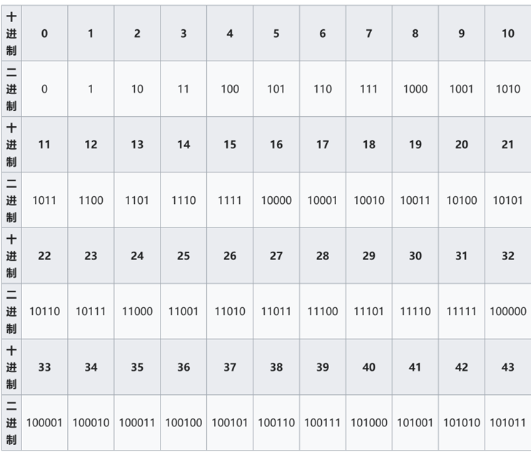
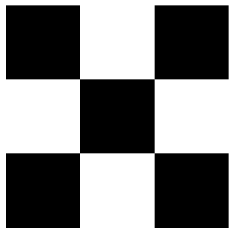
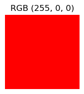
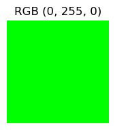
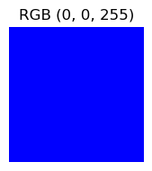
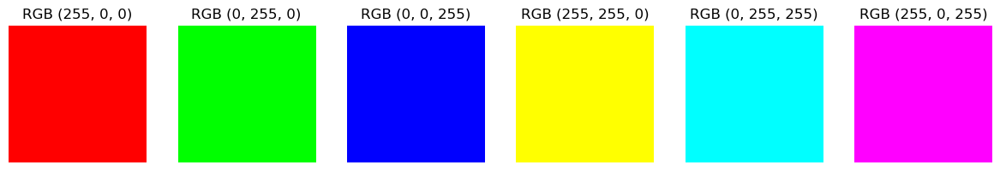
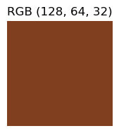

# Python编程入门


<!-- WARNING: THIS FILE WAS AUTOGENERATED! DO NOT EDIT! -->

``` python
def decimal_to_binary(decimal_num):
    if decimal_num == 0:
        return "0"
    
    binary = ""
    while decimal_num > 0:
        binary = str(decimal_num % 2) + binary
        decimal_num //= 2
    
    return binary
```



根据以上表格，我们测试一下我们写的这个小函数的功能，将一个十进制数转化为二进制数的表示。

``` python
number = 65
binary_representation = decimal_to_binary(number)
print(f"二进制数的{number}是: {binary_representation}")
```

    二进制数的65是: 1000001

## ASCII码

现在已知一个十进制的数字，可以通过前面提到的函数将其转化为二进制的表示方式。那么如果是普通的英文字母呢？

我们可以通过一组数字给每个字母编码最终转化为计算机可以识别的0和1！在Python中，我们可以通过’ord’来得到某个字母的ASCII值。

``` python
ord('A')
```

    65

``` python
??ord
```

    Signature: ord(c, /)
    Docstring: Return the Unicode code point for a one-character string.
    Type:      builtin_function_or_method

## Unicode码

如果是中文怎么表示呢？

Unicode码采用16进制编码系统来表示国际语言。

``` python
chr(0x4e2d)
```

    '中'

已知一个Unicode值，我们如何展示对应的符号呢？

``` python
def unicode_string_to_char(unicode_string):
    # Remove '0x' prefix if present and convert to integer
    unicode_value = int(unicode_string.replace('0x', ''), 16)
    return chr(unicode_value)
```

``` python
unicode_string_to_char('0x4e2d')
```

    '中'

``` python
chr(128522)
```

    '😊'

``` python
chr(128075)
```

    '👋'

## 图像

我们上网浏览时候的照片，都是由一个个的像素组成的，每一个像素就是一个点，并且由一个或者多个数字表示其性质（颜色）

``` python
import numpy as np
import matplotlib.pyplot as plt

# Create a sample matrix
C = np.array([[0, 1, 0], [1, 0, 1], [0, 1, 0]])

# Display the matrix as an image
plt.imshow(C, cmap='gray', interpolation='nearest')
plt.axis('off') # Hide axes
plt.show()
```



## RGB 值

RGB值由三个数构成，范围是0到255.\[https://rgbcolor.bchrt.com/\]

``` python
from PIL import Image, ImageDraw
import matplotlib.pyplot as plt

def create_color_square(rgb_value, size=100):
    """Create a square image of a given color."""
    img = Image.new('RGB', (size, size), color=rgb_value)
    return img

def display_colors(colors):
    """Display multiple colors in a row."""
    fig, axs = plt.subplots(1, len(colors), figsize=(len(colors)*2, 2))
    
    for i, color in enumerate(colors):
        img = create_color_square(color)
        if len(colors) > 1:
            axs[i].imshow(img)
            axs[i].axis('off')
            axs[i].set_title(f'RGB {color}')
        else:
            axs.imshow(img)
            axs.axis('off')
            axs.set_title(f'RGB {color}')
    
    plt.tight_layout()
    plt.show()
```

``` python
red = (255, 0, 0)
green = (0, 255, 0)
blue = (0, 0, 255)
yellow = (255, 255, 0)
cyan = (0, 255, 255)
magenta = (255, 0, 255)
    
# Display individual colors
display_colors([red])
display_colors([green])
display_colors([blue])
    
# Display multiple colors
display_colors([red, green, blue, yellow, cyan, magenta])
    
# Display custom RGB color
custom_color = (128, 64, 32)
display_colors([custom_color])
```











## 算法

以下是一个冒泡排序的算法，输入为一系列数字，输出为从小到大排序完的数字。

``` python
def bubble_sort(arr):
    n = len(arr)
    
    for i in range(n):
        # 判断是否更改过数字顺序
        swapped = False
        
        # 保持最后i个元素的位置
        for j in range(0, n-i-1):
            # 遍历数组从 0 to n-i-1
            # 如果当前元素大于下一个元素交换
            if arr[j] > arr[j+1]:
                arr[j], arr[j+1] = arr[j+1], arr[j]
                swapped = True
        
        # 如果没有数字交换过顺序退出
        if not swapped:
            break
    
    return arr
```

``` python
print(bubble_sort([3, 1, 5, 2, -1]))
```

    [-1, 1, 2, 3, 5]

``` python
print("hello world")
```

``` python
print("hello world, my name is")
```
