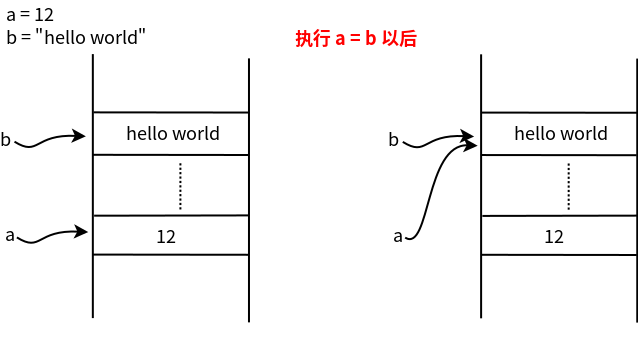

# 变量


<!-- WARNING: THIS FILE WAS AUTOGENERATED! DO NOT EDIT! -->

``` python
a = 12
```

``` python
print(a)
```

    12

Python在内存中创建了一个数12，并用a指向了它。

``` python
b = "Hello world"
```

``` python
print(b)
```

    Hello world

``` python
?id
```

    Signature: id(obj, /)
    Docstring:
    Return the identity of an object.

    This is guaranteed to be unique among simultaneously existing objects.
    (CPython uses the object's memory address.)
    Type:      builtin_function_or_method

此时Python在内存中创建了一个字符串”Hello world”, 并用b指向了它。

``` python
??id
```

    Signature: id(obj, /)
    Docstring:
    Return the identity of an object.

    This is guaranteed to be unique among simultaneously existing objects.
    (CPython uses the object's memory address.)
    Type:      builtin_function_or_method

我们可以通过函数`id`来找到每个对象所在的内存位置。

``` python
print(f'a的id是{id(a)}')
```

    a的id是140714425662232

``` python
print(f'b的id是{id(b)}')
```

    b的id是2673917645360

``` python
a = 13
print(f"a的id是{id(a)}")
```

    a的id是140714425662264

``` python
# 我们可以看看当执行a = b会发生什么
a = b
print(f'a的值是{a}, a的id值是{id(a)}')
print(f'b的值是{b}, b的id值是{id(b)}')
```

    a的值是Hello world, a的id值是2673917645360
    b的值是Hello world, b的id值是2673917645360

当执行`a=b`以后，`a`和`b`指向同一个地址。如图


### 不可变数据类型

在Python中，不可变数据类型是指一旦创建就不能被修改的对象。让我们继续上面的例子重新给`a`赋值。

``` python
a = 10
print(f'a的值是{a}, a的id值是{id(a)}')
print(f'b的值是{b}, b的id值是{id(b)}')
```

    a的值是10, a的id值是140714425662168
    b的值是Hello world, b的id值是2673917645360

当执行完`a=10`以后,
Python在内存中创建了一个整数10，并用a指向了它。b的值还有内存地址都不变。

``` python
b = "Python is fun"
print(f'b的值是{b}, b的id值是{id(b)}')
```

    b的值是Python is fun, b的id值是2673941822576

### 可变数据类型

我们来看如果修改可变数据类型，会发生什么。

``` python
list1 = [1, 2, 3]
list2 = list1

print(f"list1: {list1}, list1的id: {id(list1)}")
print(f"list2: {list2}, list2的id: {id(list2)}")
```

    list1: [1, 2, 3], list1的id: 2673941775232
    list2: [1, 2, 3], list2的id: 2673941775232

``` python
list1.append(4)
print(f"修改后list1: {list1}, list1的id: {id(list1)}")
print(f"list2: {list2}, list2的id: {id(list2)}")
```

    修改后list1: [1, 2, 3, 4], list1的id: 2673941775232
    list2: [1, 2, 3, 4], list2的id: 2673941775232

- 创建列表 list1 = \[1, 2, 3\] 时,Python在内存中创建了这个列表对象。
- list2 = list1 使list2指向同一个列表对象。
- 当我们修改list1时(如append),实际上是修改了它指向的对象。因为list2指向同一个对象,所以list2也会看到这个变化。

``` python
def modify_list(lst):
    lst.append(5)

modify_list(list1)
print(f"函数调用后list1: {list1}")
print(f"函数调用后list2: {list2}")
```

    函数调用后list1: [1, 2, 3, 4, 5]
    函数调用后list2: [1, 2, 3, 4, 5]

- 在Python中,函数参数是通过引用传递的。
- 当我们将list1传给函数modify_list时,函数内的lst参数指向与list1相同的对象。
- 因此,函数内对lst的修改会影响到list1和list2。

``` python
def create_object():
    temp = "这是一个临时对象"
    print(f"临时对象的id: {id(temp)}")

create_object()
```

    临时对象的id: 2673941931520

- 在函数create_object中,我们创建了一个临时字符串对象。
- 当函数结束后,这个对象不再被任何变量引用,Python的垃圾回收机制会在适当的时候将其删除,释放内存。
